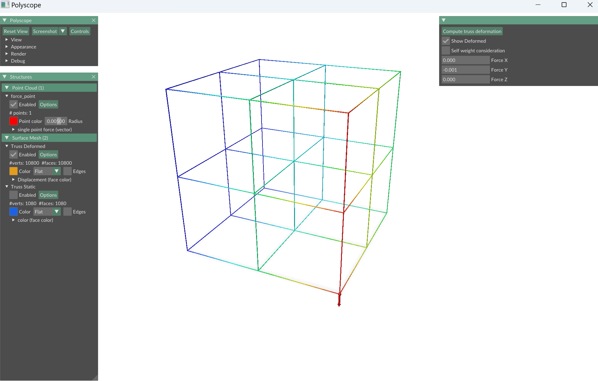
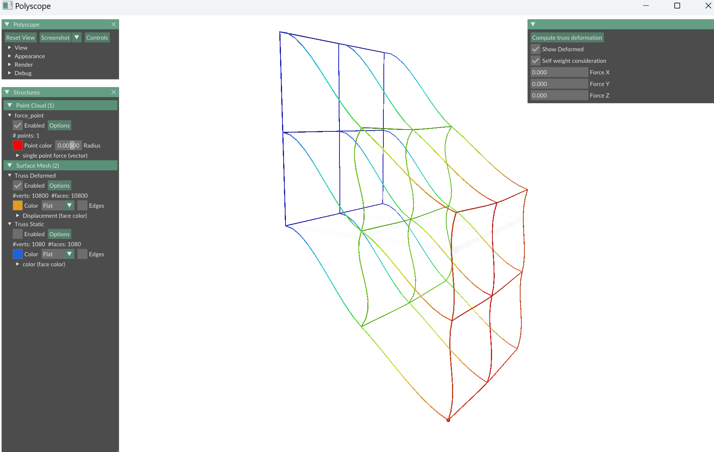
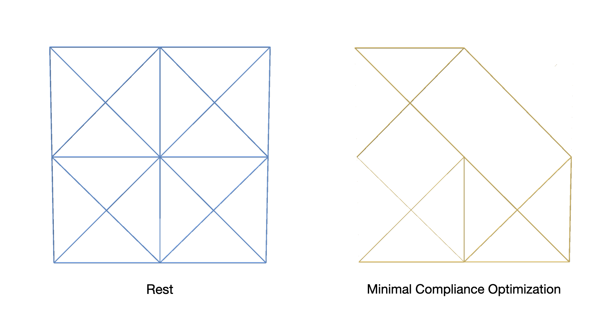

# Grid Truss Structure Simulation

This project simulates the deformation of a grid truss structure.

## Setup and Configuration

1. **Adjust Truss Settings:**
   - Open `simulation.py` and modify the values of `nx`, `ny`, and `nz` to define the grid dimensions of the truss.
   - You can also modify the position of a single force point in the grid by adjusting its coordinates in the script.

2. **Launch the Simulation:**
   - Run the script to start the simulation.

## Using the Polyscope Viewer

1. In the Polyscope viewer, you can configure the following parameters:
   - **Global Applied Force:** Specify the force applied to the truss structure by inputting the value.
   - **Self Weight Consideration:** Decide whether to account for the self-weight of the truss rods.

2. After configuring the settings, press the **"Compute Truss Deformation"** button to compute the deformation of the truss under the applied force.

## External force
   

## Self weight
  

## Topology Optimization
1. **SDP_check.py** and **SDP_visualization.py** require installing [mosek](https://docs.mosek.com/latest/pythonfusion/index.html).
2. **knitro_pnc.py** and **knitro_pnc_binary.py** require installing [knitro](https://www.artelys.com/solvers/knitro/).  
3. **scip-sdp-generate.py** is for generating .dat-s file to be solved by [SCIP-SDP](http://www.opt.tu-darmstadt.de/scipsdp/).
   
